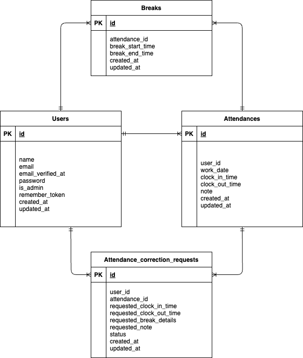

# 勤怠管理アプリ (Attendance Management System)

## 概要

このアプリケーションは、従業員の出退勤、休憩時間を記録・管理するための勤怠管理システムです。
一般ユーザーは自身の勤怠を打刻・確認でき、管理者ユーザーは全従業員の勤怠情報を閲覧・管理することができます。

## 環境構築

### Docker ビルド

1.  リポジトリをクローンします。
    ```bash
    git clone https://github.com/rrencanno/AttendanceManagement
    ```
2.  プロジェクトディレクトリに移動します。
    ```bash
    cd AttendanceManagement
    ```
3.  Dockerコンテナをビルドして起動します。
    ```bash
    docker-compose up -d --build
    ```

> **Note**
> MySQL がお使いの環境によって正常に起動しない場合は、各 PC の環境に合わせて`docker-compose.yml` ファイルを編集してください。

### Laravel 環境構築

1.  PHPコンテナの中に入ります。
    ```bash
    docker-compose exec php bash
    ```
2.  `.env.example` ファイルをコピーして `.env` ファイルを作成します。
    ```bash
    cp .env.example .env
    ```

    `.env` ファイルの環境変数を変更:

    ```
    DB_CONNECTION=mysql
    DB_HOST=mysql
    DB_PORT=3306
    DB_DATABASE=laravel_db
    DB_USERNAME=laravel_user
    DB_PASSWORD=laravel_pass
    ```

3.  PHPの依存パッケージをインストールします。
    ```bash
    composer install
    ```
4.  アプリケーションキーを生成します。
    ```bash
    php artisan key:generate
    ```
5.  マイグレーションを実行してデータベースにテーブルを作成します。
    ```bash
    php artisan migrate
    ```
6.  シーダーを実行して初期データ（管理者、一般ユーザー、勤怠データ）を投入します。
    ```bash
    php artisan db:seed
    ```
7.  ストレージへのシンボリックリンクを作成します。
    ```bash
    php artisan storage:link
    ```
8.  (任意) ユニットテスト・フィーチャーテストを実行する場合：
    ```bash
    php artisan test
    ```
    > **Note**
    > テストを実行すると、テスト用のデータベースが使用され、一時的にデータがリセットされる場合があります。テスト後に開発用の初期データに戻したい場合は、以下のコマンドを再度実行してください。
    > ```bash
    > php artisan migrate:fresh --seed
    > ```
9.  PHPコンテナから出ます。
    ```bash
    exit
    ```

---

## 使い方とURL

### メール認証機能について (開発環境)

-   シーダーで作成されたダミーユーザーで初めてログインする際は、メール認証が必要です。
-   ログイン後、メール認証画面に遷移しますが、この時点ではメールは自動送信されません。
-   **「認証メールを再送する」ボタンをクリック**すると、開発環境用のMailHogに認証メールが送信されます。
-   **MailHog**: [http://localhost:8025](http://localhost:8025)

### URL一覧とテスト用アカウント

-   **会員登録画面**: [http://localhost/register](http://localhost/register)
-   **ログイン画面（一般ユーザー）**: [http://localhost/login](http://localhost/login)
    -   Email: `user1@example.com`
    -   Password: `password`
-   **ログイン画面（管理者）**: [http://localhost/admin/login](http://localhost/admin/login)
    -   Email: `admin@example.com`
    -   Password: `password`
-   **phpMyAdmin**: [http://localhost:8080](http://localhost:8080)

---

## 使用技術 (実行環境)

- **PHP** 8.1.32
- **Laravel** 8.83.8
- **MySQL** 8.0.26

## ER 図


